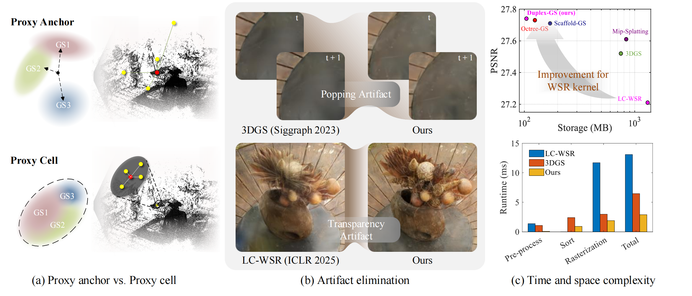
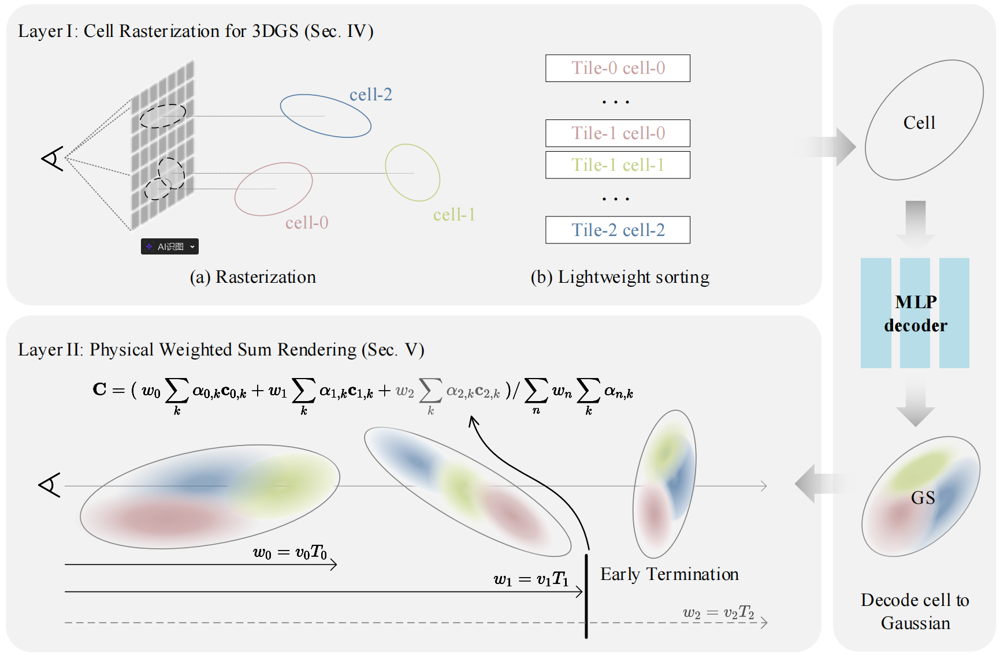

# Duplex-GS: Proxy-Guided Weighted Blending for Real-Time Order-Independent Gaussian Splatting

### [Project Page](https://duplexgs.github.io/) | [ArXiv](https://arxiv.org/abs/2508.03180)
[Weihang Liu*](https://weihangliu2024.github.io/), [Yuke Li](https://liyuke.cn/), Yuxuan Li, [Jingyi Yu](https://www.yu-jingyi.com/), [Xin Lou](https://sist.shanghaitech.edu.cn/louxin/main.htm)

## Overview

<p align="center">

</p>

<p align="center">

</p>


The paper introduces Duplex-GS, a dual-hierarchy framework that integrates order-independent rendering to significantly accelerate 3D Gaussian Splatting while reducing sorting overhead without compromising quality.

## Installation

1. Clone this repo:

```
git clone https://github.com/LiYukeee/Duplex-GS --recursive
cd Duplex-GS
```

2. Install dependencies

```
conda env create --file environment.yml
conda activate duplex
```

## Data

First, create a ```data/``` folder inside the project path by 

```
mkdir data
```

The data structure will be organised as follows:

```
data/
├── dataset_name
│   ├── scene1/
│   │   ├── images
│   │   │   ├── IMG_0.jpg
│   │   │   ├── IMG_1.jpg
│   │   │   ├── ...
│   │   ├── sparse/
│   │       └──0/
│   ├── scene2/
│   │   ├── images
│   │   │   ├── IMG_0.jpg
│   │   │   ├── IMG_1.jpg
│   │   │   ├── ...
│   │   ├── sparse/
│   │       └──0/
...
```

### Custom Data

For custom data, you should process the image sequences with [Colmap](https://colmap.github.io/) to obtain the SfM points and camera poses. Then, place the results into ```data/``` folder.


## Training

### Training Mipnerf-360

```
# This is a parallel training script. It enables `n_jobs` (default 4) processes to train at the same time.

bash mipnerf360.sh
```

### Training other scenes

 ```
cd script
bash train_xxx.sh
 ```

This script will store the log (with running-time code) into ```outputs/dataset_name/scene_name/exp_name/cur_time``` automatically.

## Evaluation
```
python render.py -m <path to trained model> # Generate renderings
```

## Result

**Matrix City**


| Method | PSNR↑ | SSIM↑ | LPIPS↓ | #GS/#Proxy↓ | FPS↑ | Time [h]↓ |
|--------|-------|-------|--------|-------------|------|-----------|
| 3DGS¹ | 27.03 | 0.808 | 0.310 | 10206 K | 66 | 2.60 |
| Scaffold-GS | 26.82 | 0.811 | 0.288 | 4829 K | 113 | 2.31 |
| Octree-GS | 25.18 | 0.738 | 0.397 | **4082 K** | **128** | 2.61 |
| Octree-GS* | 26.61 | 0.812 | 0.292 | 8010 K | 79 | - |
| LC-WSR | 26.34 | 0.782 | 0.340 | 7841 K | 34 | 3.86 |
| **Ours (K = 5)** | **27.40** | **0.826** | **0.260** | 4165 K | 119 | **2.21** |

*\* Officially released pretrained model.*

**Mip-NeRF360**
| Method | PSNR↑ | SSIM↑ | LPIPS↓ | Storage↓ |
|--------|-------|-------|--------|----------|
| Mip-NeRF360¹ | 27.69 | 0.792 | 0.237 | - |
| 3DGS¹ | 27.52 | 0.813 | 0.222 | 750.2 MB |
| Mip-Splatting¹ | 27.61 | **0.816** | **0.215** | 838.4 MB |
| Scaffold-GS¹ (K=10) | 27.73 | 0.812 | 0.226 | 171.0 MB |
| Scaffold-GS¹ (K=5) | 27.74 | 0.811 | 0.230 | 205.3 MB |
| Octree-GS¹ (K=10) | 27.88 | **0.816** | 0.216 | 142.7 MB |
| Octree-GS¹ (K=5) | 27.73 | 0.813 | 0.227 | 124.5 MB |
| LC-WSR² | 27.21 | 0.800 | 0.219 | 1312.0 MB |
| Ours (K=10) | **27.90** | 0.813 | 0.216 | 152.2 MB |
| Ours (K=5) | 27.74 | 0.802 | 0.218 | **104.4 MB** |

**Tanks & Temples**
| Method | PSNR↑ | SSIM↑ | LPIPS↓ | Storage↓ |
|--------|-------|-------|--------|----------|
| Mip-NeRF360¹ | 22.22 | 0.759 | 0.257 | - |
| 3DGS¹ | 23.57 | 0.845 | 0.180 | 431.4 MB |
| Mip-Splatting¹ | 23.96 | 0.856 | 0.171 | 500.4 MB |
| Scaffold-GS¹ (K=10) | 24.09 | 0.858 | 0.165 | 147.7 MB |
| Scaffold-GS¹ (K=5) | 24.53 | 0.863 | 0.162 | 177.7 MB |
| Octree-GS¹ (K=10) | **24.60** | 0.864 | 0.157 | 77.8 MB |
| Octree-GS¹ (K=5) | 24.47 | 0.861 | 0.168 | **73.9 MB** |
| LC-WSR² | 23.22 | 0.832 | 0.186 | 672.7 MB |
| Ours (K=10) | 24.26 | **0.867** | 0.150 | 124.8 MB |
| Ours (K=5) | 24.32 | **0.867** | **0.138** | 112.2 MB |

**Deep Blending**
| Method | PSNR↑ | SSIM↑ | LPIPS↓ | Storage↓ |
|--------|-------|-------|--------|----------|
| Mip-NeRF360¹ | 29.40 | 0.901 | 0.245 | - |
| 3DGS¹ | 29.61 | 0.900 | 0.251 | 662.7 MB |
| Mip-Splatting¹ | 29.56 | 0.901 | 0.243 | 736.8 MB |
| Scaffold-GS¹ (K=10) | 30.42 | **0.912** | 0.246 | 111.2 MB |
| Scaffold-GS¹ (K=5) | 30.26 | 0.911 | 0.242 | 143.4 MB |
| Octree-GS¹ (K=10) | **30.44** | 0.911 | 0.239 | 95.5 MB |
| Octree-GS¹ (K=5) | 30.06 | 0.908 | 0.250 | **75.1 MB** |
| LC-WSR² | 29.90 | 0.901 | 0.243 | 810.7 MB |
| Ours (K=10) | 30.30 | 0.910 | 0.249 | 89.7 MB |
| Ours (K=5) | 30.26 | 0.909 | **0.236** | 94.7 MB |


[1] Experiments are conducted using the official public repository, with no modifications except for iteration settings as described in Sec. 4.

[2] The official implementation has not been released. Experiments are conducted using our own implementation, which is available at [https://github.com/LiYukeee/sort-free-gs](https://github.com/LiYukeee/sort-free-gs).

## Citation

If you find our work helpful, please consider citing:

```bibtex
@misc{liu2025duplexgsproxyguidedweightedblending,
      title={Duplex-GS: Proxy-Guided Weighted Blending for Real-Time Order-Independent Gaussian Splatting}, 
      author={Weihang Liu and Yuke Li and Yuxuan Li and Jingyi Yu and Xin Lou},
      year={2025},
      eprint={2508.03180},
      archivePrefix={arXiv},
      primaryClass={cs.CV},
      url={https://arxiv.org/abs/2508.03180}, 
}
```

## LICENSE

Please follow the LICENSE of [3D-GS](https://github.com/graphdeco-inria/gaussian-splatting).